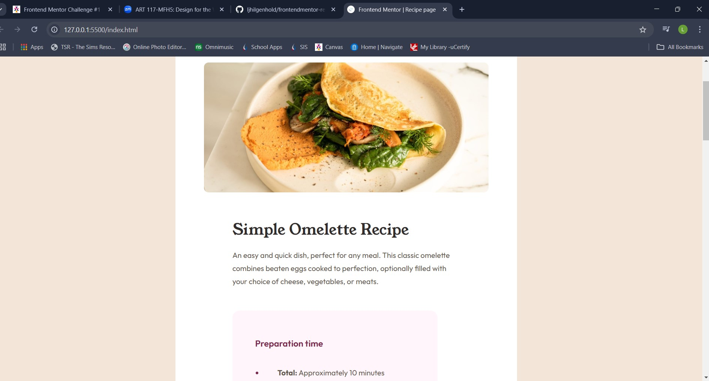
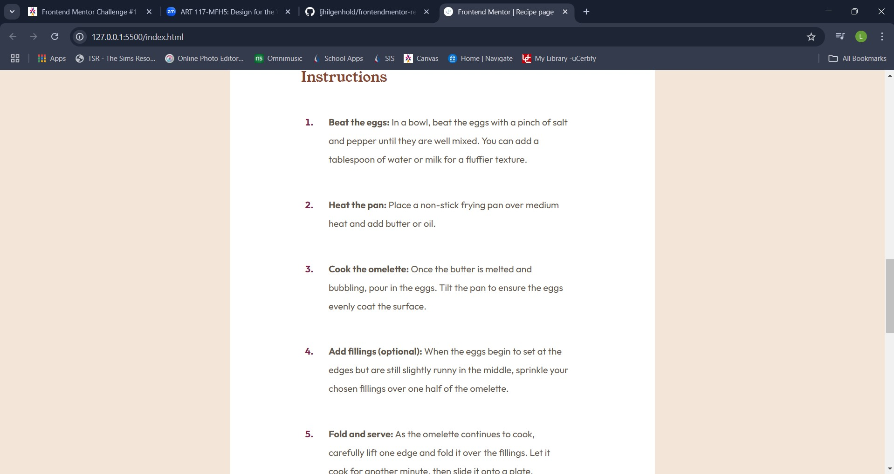
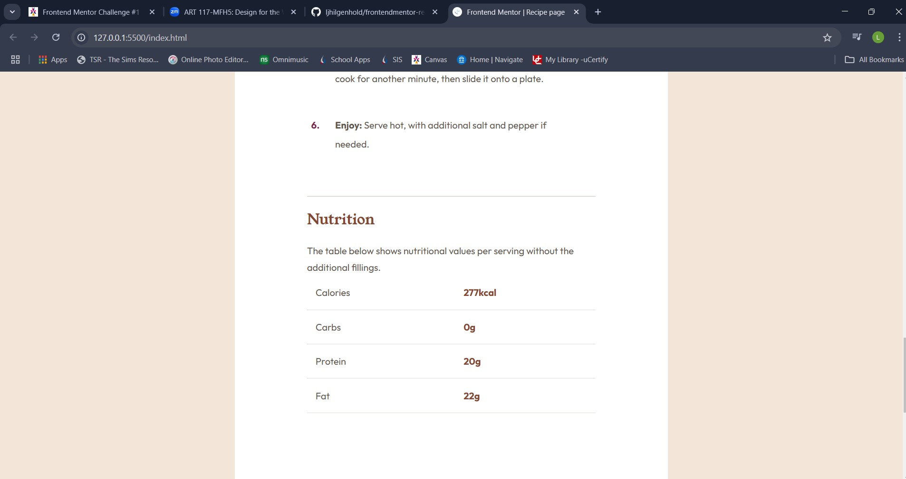

# Frontend Mentor - Recipe page solution

This is a solution to the [Recipe page challenge on Frontend Mentor](https://www.frontendmentor.io/challenges/recipe-page-KiTsR8QQKm). Frontend Mentor challenges help you improve your coding skills by building realistic projects. 

## Table of contents

- [Overview](#overview)
  - [The challenge](#the-challenge)
  - [Screenshot](#screenshot)
  - [Links](#links)
- [My process](#my-process)
  - [Built with](#built-with)
  - [What I learned](#what-i-learned)
  - [Continued development](#continued-development)
- [Author](#author)
- [Acknowledgments](#acknowledgments)


## Overview
Frontend Mentor Recipe Challenge.

### Screenshot







### Links

- Solution URL: [solution URL](https://www.frontendmentor.io/solutions/responsive-layout-mobile-first-css-variables-html-css3-4IonOeVik7)
- Live Site URL: [live site URL](https://ljhilgenhold.github.io/frontendmentor-recipe/)

## My process
Started with a mobile-first approach and then created the desktop version after.
### Built with

- Semantic HTML5 markup
- CSS custom properties
- Flexbox
- CSS Grid
- Mobile-first workflow
- [React](https://reactjs.org/) - JS library
- [Next.js](https://nextjs.org/) - React framework
- [Styled Components](https://styled-components.com/) - For styles


### What I learned

I learned how to make a website responsive as well as how to go about designing with the mobile-first approach.
To see how you can add code snippets, see below:

```html
<h1>Some HTML code I'm proud of</h1>
```
```css
@media screen and (min-width: 800px) {
    body {
        background-color: var(--stone-100);
        padding: 10%;
    }
    ```
    .wrapper{
        width: 50%;
        background-color: white;
        border-radius: 10px;
        margin: auto;
        padding: 5%;
    }
  ```
    header img {
        border-radius: 10px;
    }
}
```

### Continued development

I want to continue learning how to make websites responsive to different devices.


## Author

- Frontend Mentor - [@ljhilgenhold](https://www.frontendmentor.io/profile/ljhilgenhold)


## Acknowledgments
I completed this challenge with the help of Professor McLeod and my Art 117 spring 2025 classmates.
